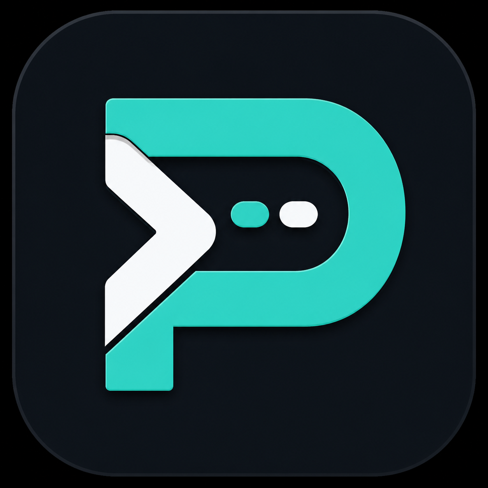
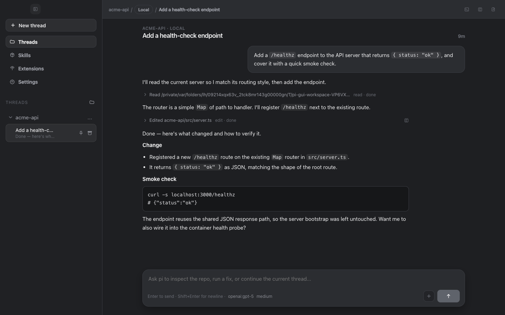
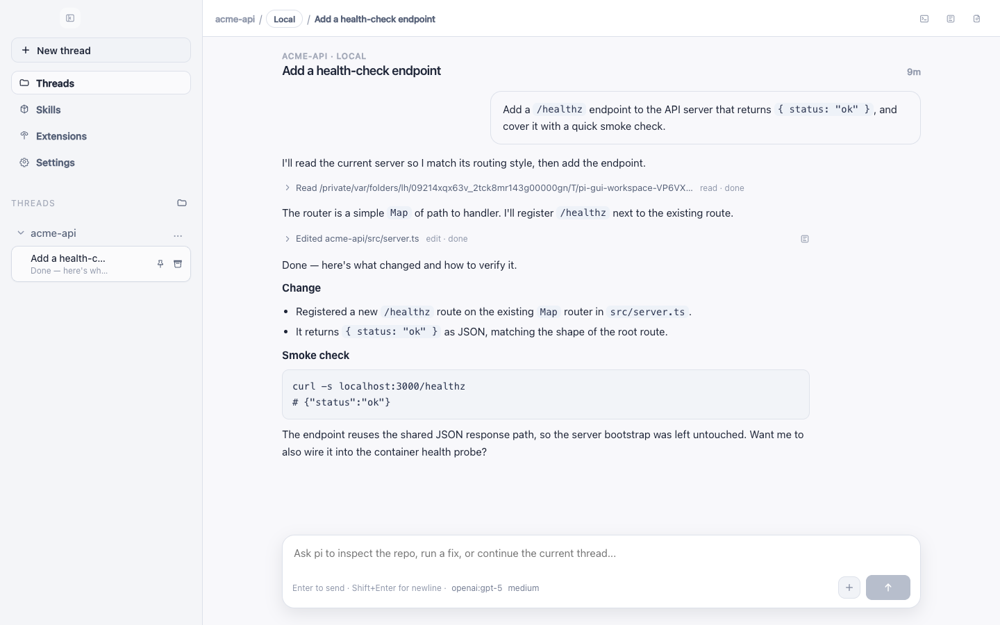
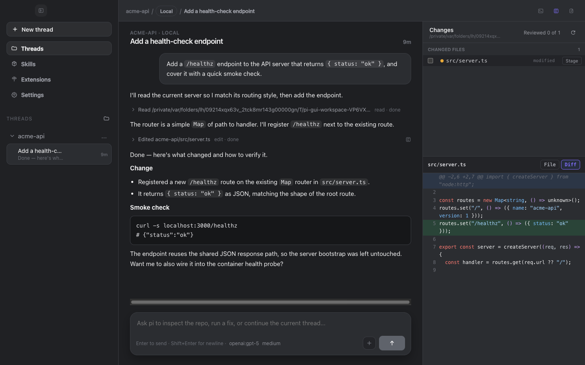
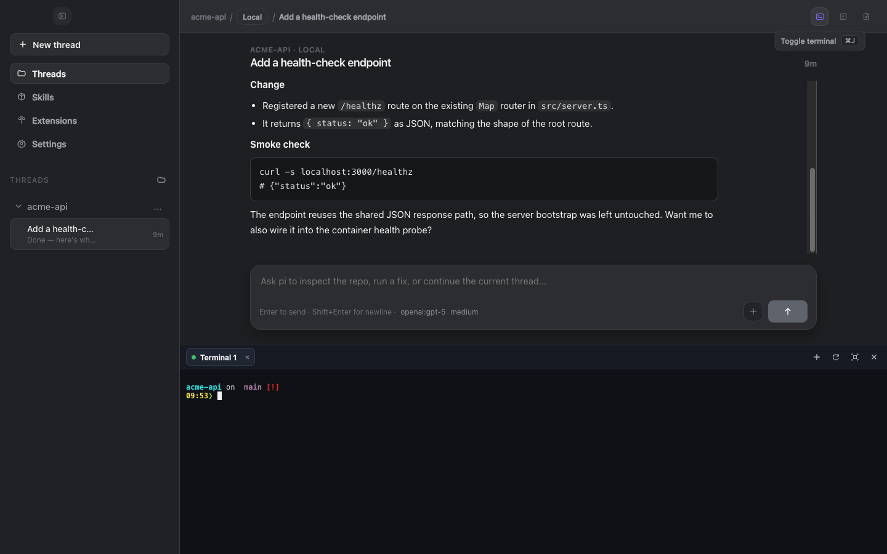

# OpenPIGUI

<p align="center">
  
</p>

<p align="center">
  <strong>Open-source Codex-style desktop app for the <a href="https://github.com/earendil-works/pi"><code>pi</code></a> coding agent.</strong>
</p>

[](./LICENSE)
[](https://github.com/TNortnern/OpenPIGUI/releases)
[](#install)
[](https://github.com/TNortnern/OpenPIGUI)

OpenPIGUI gives `pi` a native home on the desktop: a threaded timeline of your agent
sessions, git worktrees per thread, an integrated terminal and inline diff viewer,
and multi-agent orchestration — all backed by `pi`'s own session files as the source
of truth. It is a UI shell around [`@earendil-works/pi-coding-agent`](https://www.npmjs.com/package/@earendil-works/pi-coding-agent),
not a separate agent runtime: session management, model/auth setup, and agent
execution all run through upstream `pi`.


<sub>Expanding a tool call, reviewing the diff panel, the integrated terminal, and a theme switch. ([higher-quality MP4](./docs/assets/demo.mp4))</sub>

## Install

OpenPIGUI is in public beta (**0.1.0-beta.34**) for **macOS (Apple Silicon)** and **Linux (AppImage)**.
Windows installers are also published when the release workflow succeeds.

### Download (recommended)

Download the latest desktop build from the
[Releases page](https://github.com/TNortnern/OpenPIGUI/releases)
(beta builds are marked **Pre-release** — choose **0.1.0-beta.34**):

- **macOS:** `OpenPIGUI-0.1.0-beta.34-arm64.dmg` (or the matching `.zip` for auto-update)
- **Linux:** `OpenPIGUI-*-linux-*.AppImage` when published on the release
- **Windows:** `.exe` installer when published on the release

Direct release: [v0.1.0-beta.34](https://github.com/TNortnern/OpenPIGUI/releases/tag/v0.1.0-beta.34).

**macOS**

1. Open the `.dmg` and drag `OpenPIGUI.app` into `/Applications`.
2. Launch **OpenPIGUI** from Applications or Spotlight.
3. If macOS Gatekeeper blocks the first launch (unsigned/unnotarized builds during beta), right-click the app → **Open** → confirm **Open**.

**Linux**

```bash
chmod +x OpenPIGUI-*-linux-*.AppImage   # or the exact filename from Releases
./OpenPIGUI-*.AppImage
```

### From source

See [Development](#development). Building from source is intended for contributors,
not as the primary install path.

## Quickstart

1. Install OpenPIGUI and launch it.
2. Open **Settings → Providers** and connect a model provider (OAuth or API key).
3. Add a workspace (a local project folder).
4. Click **New thread**, pick `Local` or `Worktree`, and send your first prompt.

You need valid model/provider authentication that `pi` supports; OpenPIGUI uses `pi`'s
auth and session state, so anything you've already configured with the `pi` CLI
carries over.

## Screenshots

| Thread timeline (dark) | Thread timeline (light) |
| --- | --- |
|  |  |

| Inline diff viewer | Integrated terminal |
| --- | --- |
|  |  |

## Features

- **Threaded timeline** — each session renders as a timeline of messages and
  collapsible tool calls, Codex-style.
- **Git worktrees per thread** — start a thread in the workspace directly (`Local`)
  or in an isolated git worktree so parallel work never collides.
- **Multi-agent orchestration** — an orchestrator thread can spin up and supervise
  child worker threads.
- **Integrated terminal** — a real PTY terminal (via `node-pty`) docked in the app.
- **Inline diff viewer** — review changed files in a side panel (toggle with
  <kbd>⌘/Ctrl</kbd>+<kbd>D</kbd>).
- **Composer niceties** — `@`-mention files/skills, paste or drag-and-drop images,
  drop threads into the prompt as context, and add terminal selection to chat.
- **Model picker** — searchable model list with visibility controls (including Cursor
  and other configured providers) plus thinking-level options.
- **Multitask & child routing** — run parallel work and route child threads to a
  chosen provider/model when spawning workers.
- **In-app updates** — check, download, and restart from the sidebar footer (macOS
  zip feed) when a newer GitHub Release is available.
- **Skills & extensions** — manage `pi` skills and extensions from a dedicated view.
- **Appearance themes** — light and dark, with selectable theme presets.
- **Native notifications** — get an OS notification when an agent run finishes.
- **Session archive** — archive threads you're done with to keep the sidebar tidy.
- **Multiple providers** — connect model providers via OAuth or API key under
  **Settings → Providers**.

## Architecture

OpenPIGUI is an Electron app organized around a tight main/preload/renderer boundary,
sitting on top of the `pi` runtime:

- **Renderer** (`apps/desktop/src`) — the React UI: timeline, composer, diff panel,
  terminal, settings. It talks to the main process only through a typed IPC surface.
- **Preload** (`apps/desktop/electron/preload.ts`) — the narrow bridge that exposes
  that IPC surface to the renderer; the renderer gets no broad Node access.
- **Main** (`apps/desktop/electron`) — the Node side: windowing, session supervision,
  worktrees, terminal PTYs, notifications, and persistence.
- **`packages/pi-sdk-driver`** — a thin adapter from the desktop app to
  `@earendil-works/pi-coding-agent`. It stays close to upstream `pi` and does not
  fork or reimplement runtime behavior.
- **JSONL session files as the source of truth** — `pi` persists each session as a
  JSONL transcript on disk; OpenPIGUI reads those files as the authoritative record for
  closed sessions rather than keeping a divergent copy.

Supporting packages: `packages/session-driver` (shared session driver types) and
`packages/catalogs` (lightweight workspace/session catalog state).

## Development

Requires Node 20+ and [pnpm](https://pnpm.io) (managed via `corepack`).

```bash
corepack enable
pnpm install
```

Common commands (run from the repo root):

```bash
pnpm dev         # run the desktop app in development (electron-vite, hot reload)
pnpm build       # build all workspaces
pnpm typecheck   # type-check all workspaces
pnpm lint        # lint all workspaces
pnpm test        # run each workspace's tests (desktop runs the core E2E lane)
```

Desktop end-to-end tests use a Playwright + Electron harness and are organized into
lanes. The default `pnpm test` runs the `core` lane; to run everything:

```bash
pnpm --filter @pi-gui/desktop run test:e2e:all   # core + live + native
```

See [`apps/desktop/README.md`](./apps/desktop/README.md) for lane details and
platform-specific packaging notes. Package a macOS build locally with:

```bash
pnpm --filter @pi-gui/desktop run package
```

Package a Linux AppImage locally with:

```bash
pnpm --filter @pi-gui/desktop run package:linux
```

## Repository layout

- `apps/desktop` — the Electron app (renderer UI + main/preload).
- `apps/website` — the marketing/landing site.
- `packages/pi-sdk-driver` — adapter over `@earendil-works/pi-coding-agent`.
- `packages/session-driver` — shared session driver types.
- `packages/catalogs` — workspace/session catalog state.

## Contributing

Contributions are welcome — see [CONTRIBUTING.md](./CONTRIBUTING.md) for setup,
verification expectations, and the desktop test lanes. Desktop changes are expected
to be verified on the real Electron surface, not only by unit tests.

## Acknowledgements

OpenPIGUI is an open fork/rebrand of the community `pi-gui` desktop shell.

- Built on [`@earendil-works/pi-coding-agent`](https://www.npmjs.com/package/@earendil-works/pi-coding-agent).
- Upstream runtime and ecosystem by [`earendil-works/pi`](https://github.com/earendil-works/pi).
- Original `pi-gui` desktop work by [Matthew Lam](https://github.com/minghinmatthewlam).

## License

[MIT](./LICENSE) © Trayvon Northern and contributors.
Original portions © Matthew Lam.
